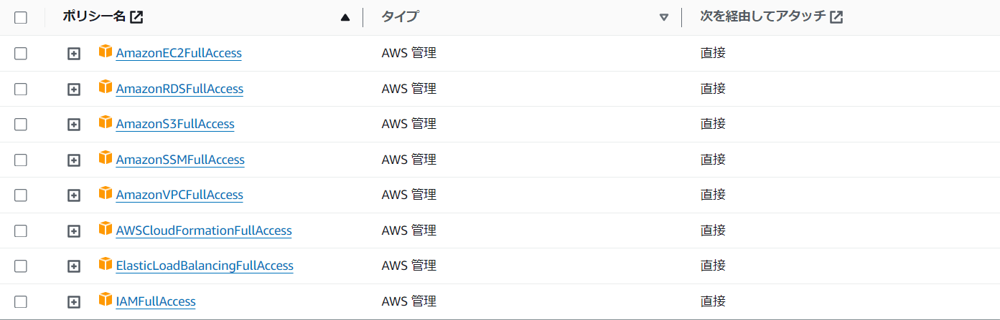

# 手動構築する部分
1. SSMパラメータストアで名前が`rds_master_password`、値にRDSのマスターパスワードを記載したものを保存する。保存するパラメータのタイプは安全な文字列（SecureString）を選択する。
2. IAMで以下のポリシーをアタッチしたIAMユーザを作成する。

3. 以下のようにCircleCIの環境変数に保存する。 
### AWS_REGION
us-east-1
### AWS_ACCESS_KEY_ID
2で作成したIAMユーザーのアクセスキー
### AWS_SECRET_ACCESS_KEY
2で作成したIAMユーザーのシークレットアクセスキー
