# インフラ環境のデプロイからテストコードの実行までを自動化
## Pipeline

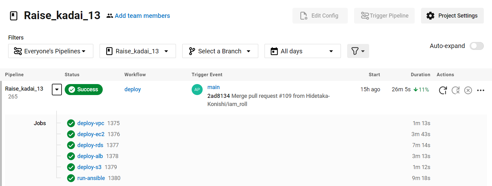

## deploy-vpc

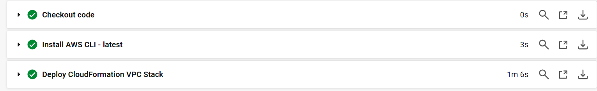

## deploy-ec2

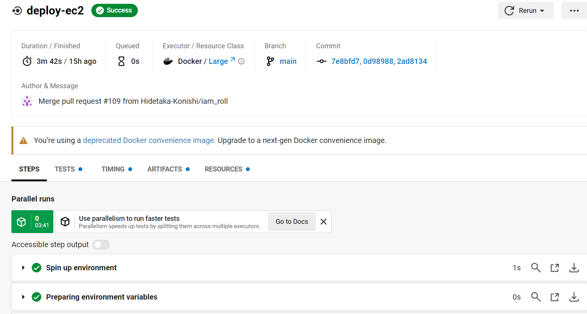
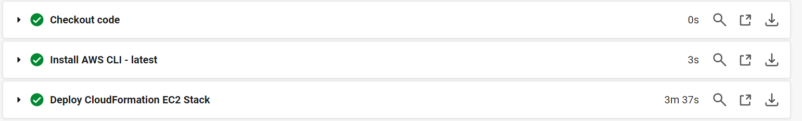

## deploy-rds

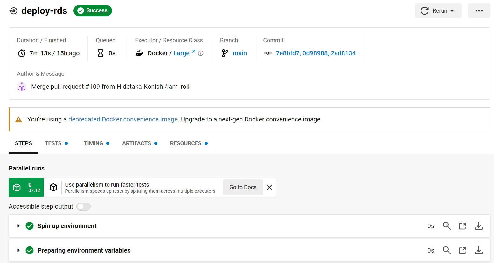
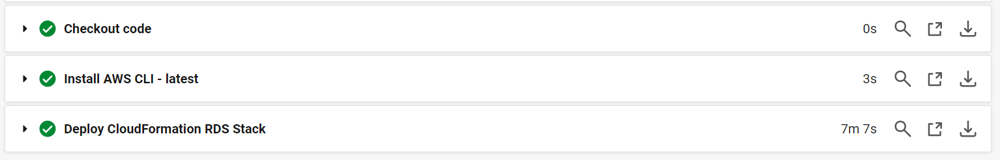

## deploy-alb

## deploy-s3

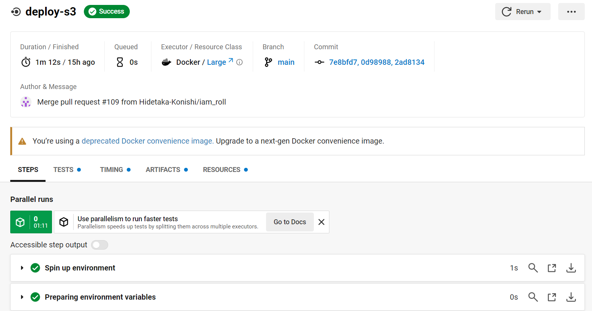
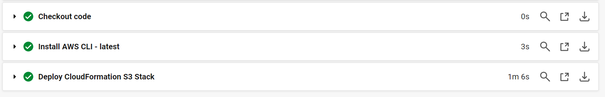

## run-ansible

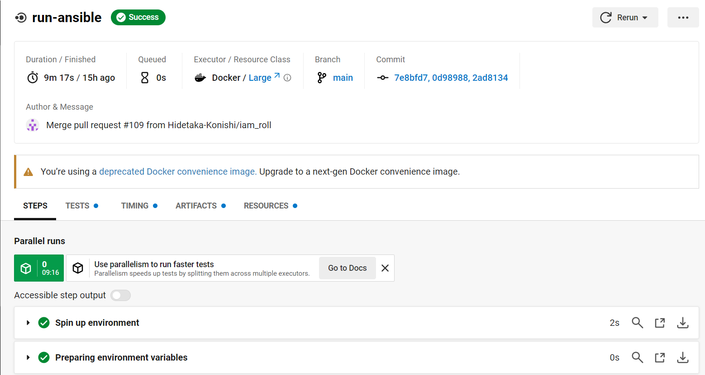
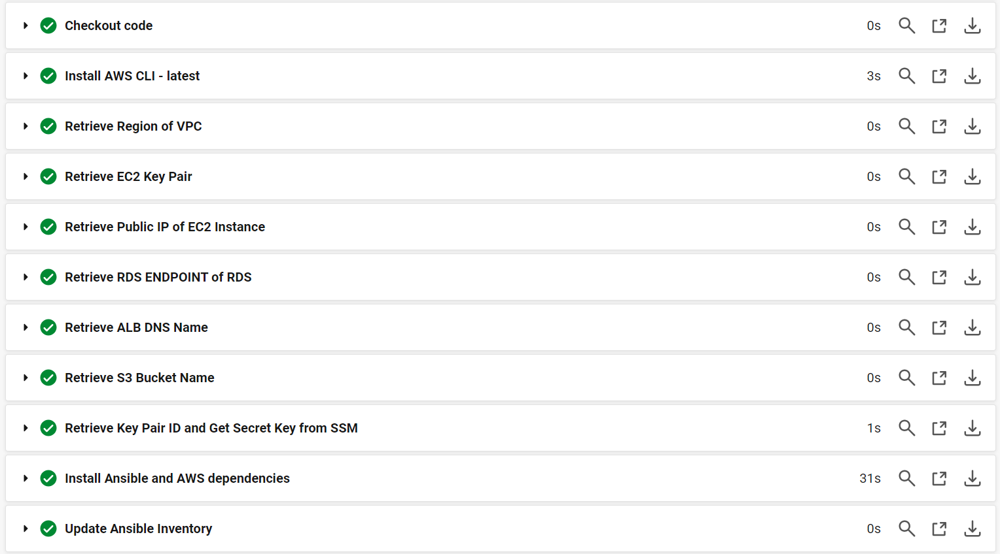
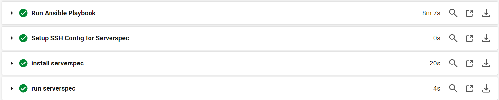

## Serverspecのテスト成功

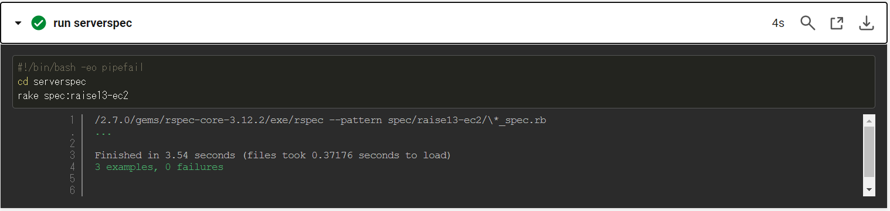

## 失敗するテストを加えてServerspecを実行

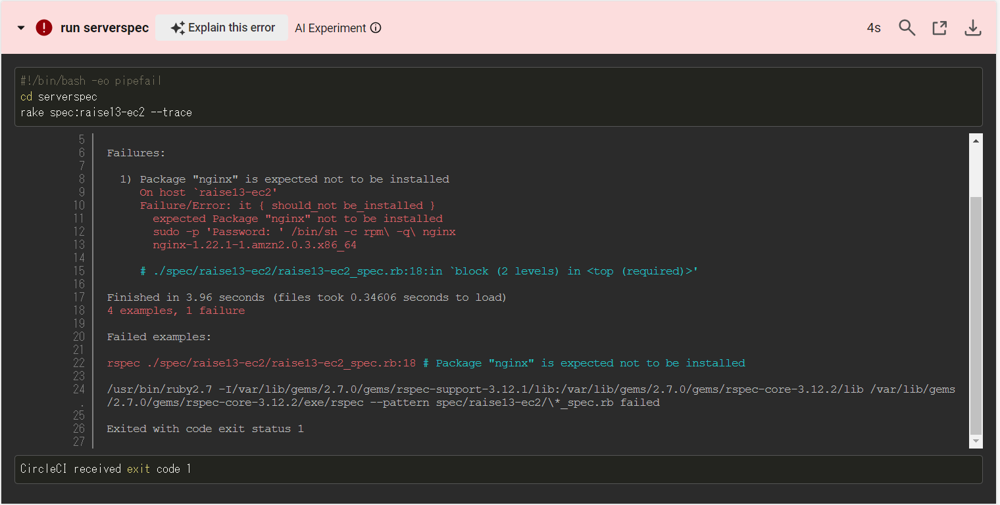

## ALB経由でアプリケーションにアクセス

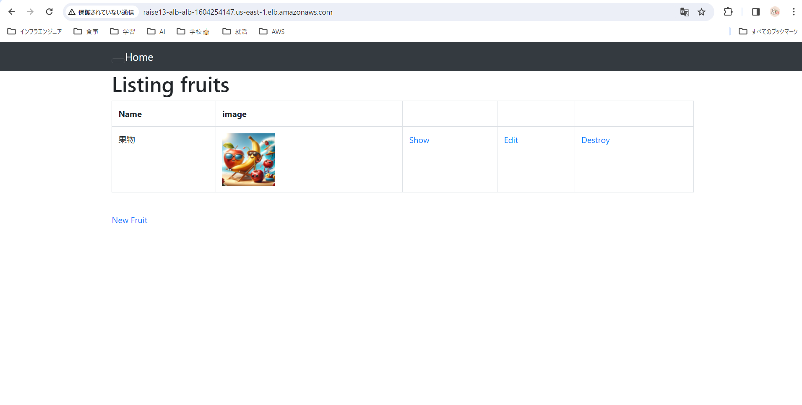

## 画像をアップロードしたあとのS3バケット

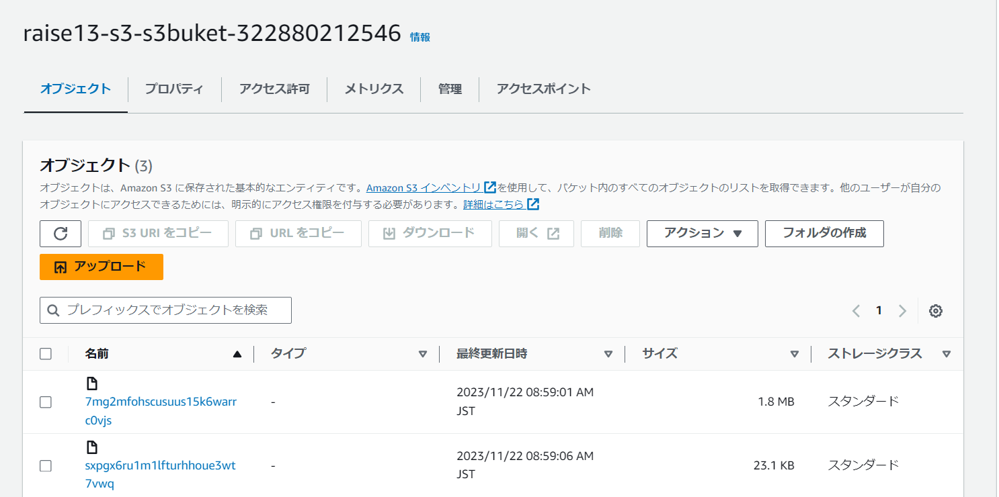

