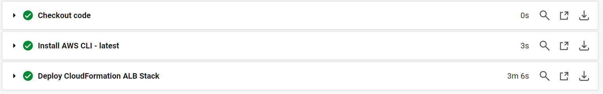

# インフラ環境のデプロイからテストコードの実行までを自動化
## Pipeline

## deploy-vpc

## deploy-ec2

## deploy-rds

## deploy-alb

## deploy-s3

## run-ansible

## Serverspecのテスト成功

## 失敗するテストを加えてServerspecを実行

## ALB経由でアプリケーションにアクセス

## 画像をアップロードしたあとのS3バケット

